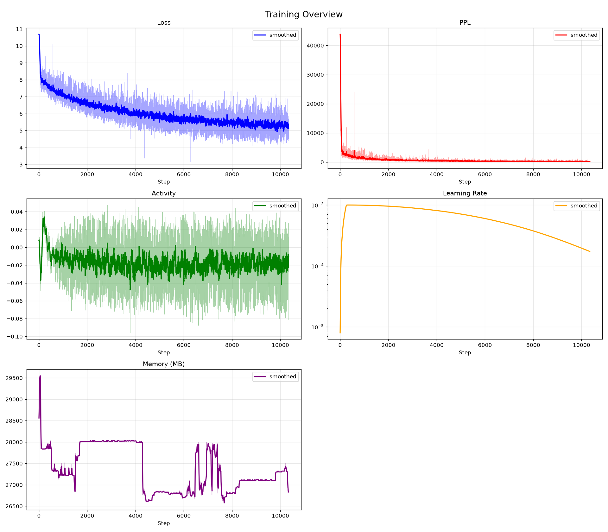
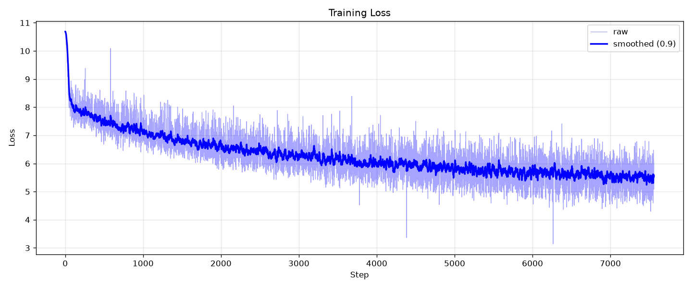
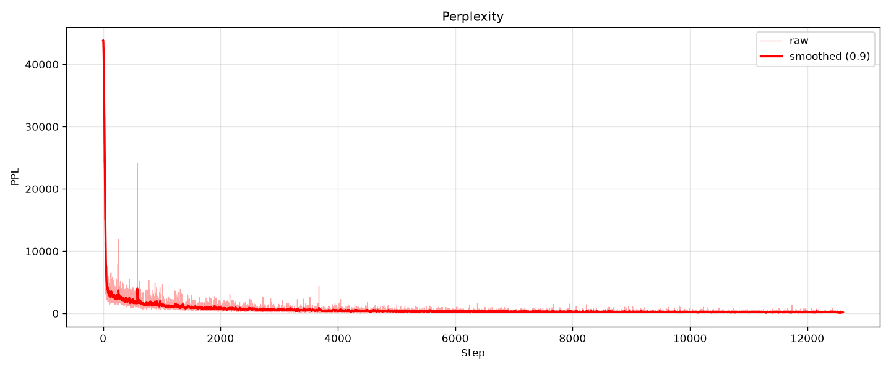
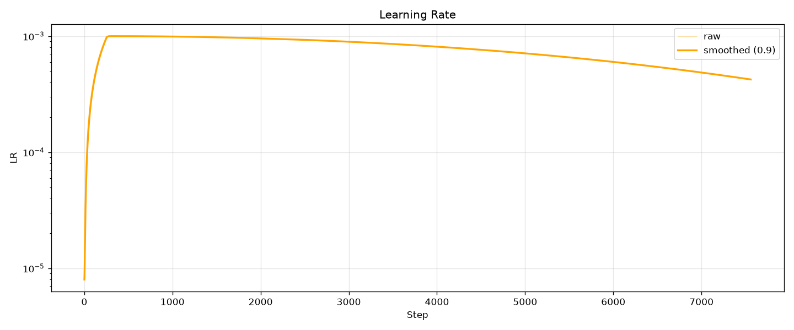
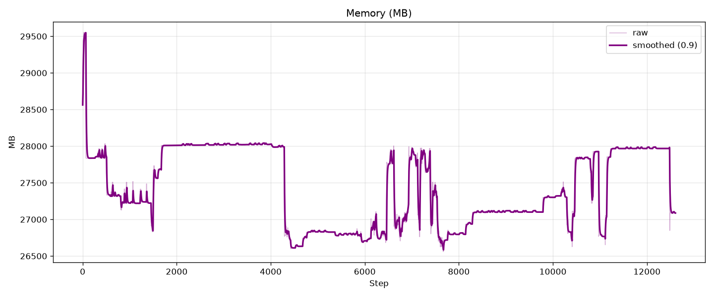
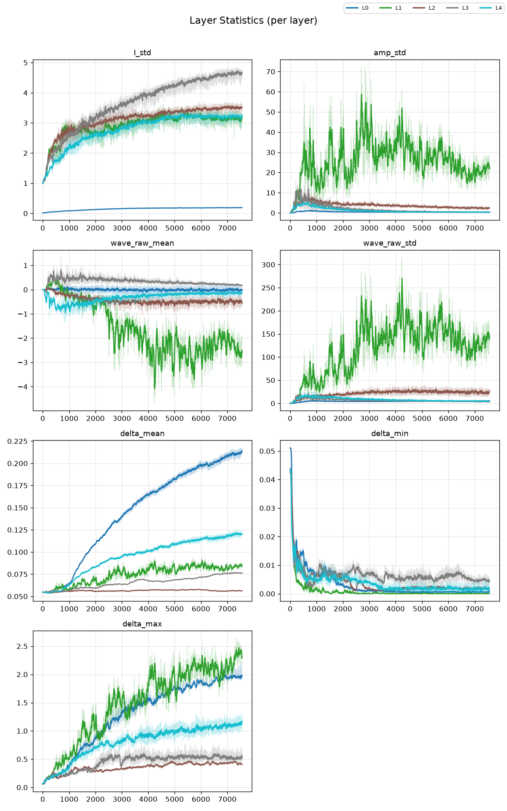
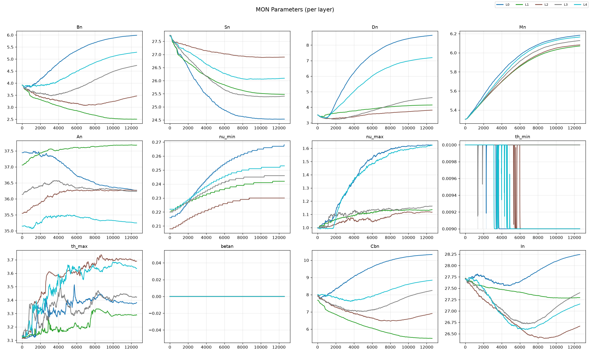

# Waver-SNN-SSM: 从脉冲到状态空间的统一序列建模框架

[](https://doi.org/10.5281/zenodo.22309186)
[](https://orcid.org/0009-0006-4332-1295)
[](https://www.gnu.org/licenses/gpl-3.0)
[](https://www.python.org/downloads/)
[](https://pytorch.org/)

**Waver-SNN-SSM** 是一个从脉冲神经网络（SNN）出发，最终演进到与 **Mamba-3** 理念殊途同归的高效状态空间模型（SSM）实现。本项目将复值 SSM 的复数算子完整替换为实值 2×2 块同构，彻底移除了训练时的复数中间张量，从而安全启用 BF16 混合精度训练，大幅降低显存占用并加速训练。

---

## 📖 项目亮点

1. **彻底的复数化（Complex-to-Real 2×2 块同构）**  
   在代数层面实现“无复数”的复数 SSM，安全开启 BF16 AMP 加速。每个复矩阵元 `a+bi` 被替换为实矩阵 `[[a, -b], [b, a]]`，实虚通道自然交替，无任何 complex 类型的中间张量。

2. **可选的“读写头”（全局摘要器）**  
   独创 **Mean / LinearAttention / MiniWave** 三种全局摘要器，为 SSM 提供显式的全局信息参考，弥补 SSM 固有的上下文压缩局限。

3. **更灵活的层内耦合（Intra-layer Coupling）**  
   内置可学习的子通道间耦合矩阵（斜埃尔米特结构），比 Mamba 的对角/标量矩阵更具表达力，状态通道间可交叉交互。

4. **完整的 MoE 集成与工业级优化**  
   集成 MoE-FFN（SwiGLU 专家 + Top-K 路由），包含 **Expert Offload（CPU 卸载）**、**FP8/NVFP4 量化**、**Weight Normalization** 等全套优化方案，让大模型在消费级显卡上训练成为可能。

5. **“单文件 + 全配置”的工程化典范**  
   训练、推理、强化学习（GRPO/RL）全流程单文件封装，所有超参数（`HIDDEN_SIZE`、`NUM_LAYERS`、`STATE_DIM`、`MOE_ENABLED` 等）均通过顶部常量集中控制，实验可复现性极强。

6. **沿袭自 SNN 的独特迭代路径**  
   项目从脉冲神经网络（SNN）起步，历经多代演进，最终与 Mamba-3 殊途同归。这种跨越不同 AI 子领域的思考和实践，极具故事性和启发性。

---

## 🚀 快速开始

### 1. 安装依赖

```bash
pip install -r requirements.txt
```

依赖项：
- `torch >= 2.0.0`
- `numpy >= 1.24.0`
- `tokenizers >= 0.13.0`
- `psutil >= 5.9.0`（可选，用于内存监控）

### 2. 准备数据

将你的训练数据（`.txt` 或 `.jsonl` 格式）放入项目根目录。

- **`.txt` 格式**：纯文本语料，每行一个样本或连续文本，程序会自动滑动窗口切分。
- **`.jsonl` 格式**：对话数据，格式为 `{"conversations": [{"role": "user", "content": "..."}, {"role": "assistant", "content": "..."}]}`。

### 3. 训练模型

```bash
python 312002proplus_elite.py
```

然后根据菜单提示选择 `1. 从头训练模型`，并选择你的数据集文件。

---

## 📊 训练状态

本项目目前正在 RTX 5080 (16GB) 上训练 1.6B 参数模型，数据集为 52.1MB 中文名著语料（`supernovel.txt`），约 204,123 行，12.9M token，词表大小 40,000。

### 当前训练指标

| 指标 | 值 |
|------|-----|
| **Epoch** | 1/1 |
| **当前 Step** | ~10,300 / 12,600 |
| **Loss** | 5.0 ~ 5.5（波动中） |
| **PPL** | 150 ~ 250 |
| **显存占用** | ~26.8 GB |
| **进度** | ~82% |

> 📌 **为什么 Loss 看起来偏高？**  
> 这是一个 **1.6B 参数模型**在 **13M token 数据**上训练了不到 1 个 epoch 的中间状态。参考 Chinchilla 定律，1.6B 模型的最优训练数据量约为 **320 亿 token**，当前数据量仅为最优值的 **~4%**。**在如此悬殊的数据-参数比下，模型能稳定将 Loss 从初始的 ~10 降到 ~5，PPL 从 ~49000 降到 ~200，本身就是架构有效性的有力证据。**

### 📈 训练曲线总览



*上图展示了 Loss、PPL、Activity、LR 和 Memory 的全流程变化曲线。*

### 📉 分项详细曲线

| Loss | PPL |
|------|-----|
|  |  |

| Learning Rate | Memory |
|---------------|--------|
|  |  |

### 🧩 层内统计（Layer Stats）



*每层的 `I_std`、`amp_std`、`wave_raw_mean`、`wave_raw_std`、`delta_mean/min/max` 变化趋势。*

### 🔧 参数监控（MON Parameters）



*每层的 Bn、Sn、Dn、Mn、An、nu、th、betan、Cbn、In 等关键参数的演化。*

---

### 📋 实时监控数据（单步快照，Step 10331）

**各层信号传播状态：**

| Layer | I_std | wave_raw_std | delta_mean | 状态 |
|-------|-------|--------------|------------|------|
| L0    | 0.196 | 6.06         | 0.233      | ✅ 正常 |
| L1    | 2.947 | 117.5        | 0.085      | ⚡ 初期瞬态 |
| L2    | 3.358 | 14.88        | 0.058      | ✅ 正常 |
| L3    | 4.518 | 2.375        | 0.083      | ✅ 正常 |
| L4    | 3.178 | 3.516        | 0.131      | ✅ 正常 |

> `wave_raw_std` 从 L1 的 ~117 逐渐收敛到 L4 的 ~3.5，**信号逐层衰减正常，无梯度爆炸/消失**。

**MoE 专家状态：**

| Layer | Router Norm | W_gate | W_up | W_down | 状态 |
|-------|-------------|--------|------|--------|------|
| L0    | 3.53        | 1.07   | 1.07 | 1.05   | ✅ 均衡 |
| L1    | 3.43        | 1.08   | 1.08 | 1.06   | ✅ 均衡 |
| L2    | 4.29        | 1.13   | 1.12 | 1.11   | ✅ 均衡 |
| L3    | 4.87        | 1.18   | 1.18 | 1.16   | ✅ 均衡 |
| L4    | 4.58        | 1.17   | 1.16 | 1.14   | ✅ 均衡 |

> 所有专家权重范数集中在 **1.0~1.2** 之间，**路由负载均衡良好，未出现专家坍缩**——这是 MoE 训练中最常见的失败模式，本项目成功规避。

### 📂 数据集信息

| 属性 | 值 |
|------|-----|
| **文件** | `supernovel.txt` |
| **类型** | 纯文本（txt） |
| **大小** | 52.1 MB |
| **行数** | 204,123 |
| **Token 数** | 12,909,063（12.91M） |
| **词表大小** | 40,000 |
| **模型参数量** | ≈ 1.6B |

### 🔍 训练解读

#### 为什么这个结果值得关注？

| 挑战 | 本项目情况 | 意义 |
|------|-----------|------|
| **数据-参数比极端失衡** | 1.6B 参数 vs 13M token（理想值需 320 亿 token） | 模型未欠拟合，仍在稳定学习 |
| **词表规模大** | 40,000 词表 | 输出空间大，分类难度高，Loss 天然偏高 |
| **MoE 训练稳定性** | 专家权重范数 1.0~1.2，负载均衡 | 规避了 MoE 最常见的“专家坍缩”问题 |
| **信号传播** | `wave_raw_std` 逐层收敛 | 无梯度爆炸/消失，架构数值稳定 |

**关键结论：** 在最不利的数据条件下（13M token 驱动 1.6B 模型），Waver-SNN-SSM 仍能稳定训练、Loss 持续下降、MoE 负载均衡——**这验证了架构设计的有效性**。

> 💡 **提示**：以上图表由 `plot_training.py` 基于 `training_log.txt` 自动生成。你也可以运行 `python plot_watch.py` 实现实时更新绘图。
### 核心组件：`ParallelComplexWaveLayer`

这是模型的核心，它将复值 SSM 的所有算子替换为实值 2×2 块：

- **状态转移**：`h_t = A_disc @ h_{t-1} + b_t`
- **并行扫描**：使用自定义的 `BlellochScanFn` 实现高效的 O(log T) 并行前缀扫描。
- **实值 2×2 块**：`Ω = M + diag(-ν + iθ)` → `[[M - diag(ν), -diag(θ)], [diag(θ), M - diag(ν)]]`

### 全局摘要器 (Summarizer)

通过 `SUMMARY_TYPE` 切换三种模式：
- `mean`：全局平均池化（无参数基线）。
- `linear_attention`：可学习的线性注意力摘要（Key/Query 归一化，余弦相似度有界）。
- `mini_wave`：迷你的 `ParallelComplexWaveLayer` 实例，独立参数。

### MoE-FFN

集成了带有 **SwiGLU** 激活函数的混合专家模型，并通过以下参数实现显存优化：
- `MOE_OFFLOAD`：专家权重可卸载到 CPU，按需搬移。
- `MOE_EXPERT_QUANT`：支持 FP8（E4M3）训练量化或 NVFP4（E2M1）推理量化。
- `MOE_EXPERT_WNORM`：权重归一化，将每专家权重范数解耦为可学习标量，防止训练发散。

---

## 🔧 配置调优

所有关键参数均在 `312002proplus_elite.py` 文件头部定义：

| 参数 | 描述 | 默认值 |
|------|------|--------|
| `HIDDEN_SIZE` | 隐藏层维度 | 512 |
| `NUM_LAYERS` | 网络层数 | 5 |
| `STATE_DIM` | SSM 状态维度（必须为偶数） | 6 |
| `MOE_ENABLED` | 是否启用 MoE | `True` |
| `SUMMARY_TYPE` | 摘要器类型 | `'linear_attention'` |
| `USE_AMP` | 是否启用自动混合精度 | `True` |
| `FREEZE_LAYERS` | 冻结前 N 层 | 0 |
| `MAX_SEQ_LEN` | 最大序列长度 | 1024 |
| `BATCH_SIZE` | 批大小 | 1（可调大） |

---

## 📜 引用

如果你在研究中使用了本项目，请引用：

```bibtex
@misc{zeng2026waversnnssm,
  author = {Zeng, Naiqi},
  title = {Waver-SNN-SSM: From Spiking Neurons to State Space Models},
  year = {2026},
  publisher = {Zenodo},
  doi = {10.5281/zenodo.22309186},
  url = {https://doi.org/10.5281/zenodo.22309186}
}
```

---

## 📧 联系方式

- **ORCID**: [0009-0006-4332-1295](https://orcid.org/0009-0006-4332-1295)
- **Email**: X005_0001_0001@163.com

---

## 📄 许可证

本项目采用 **GNU General Public License v3.0**。任何使用、修改或分发本代码的行为，都必须遵守 GPL-3.0 的条款，即**任何衍生作品也必须以 GPL-3.0 开源**。

---

## ⚠️ 版权声明

Copyright © 2026 Naiqi Zeng. All rights reserved.

本代码及相关文档的首次公开发布时间由 Zenodo DOI 10.5281/zenodo.22309186 锁定。任何未经授权的抄袭、洗稿或未注明来源的引用，均视为侵犯版权。本项目的 GPL-3.0 许可证明确要求任何二次分发必须公开源代码，商业用途必须获得额外授权。

---

**Version**: 1.0.0  
**Last Updated**: 2026-09-05

---
