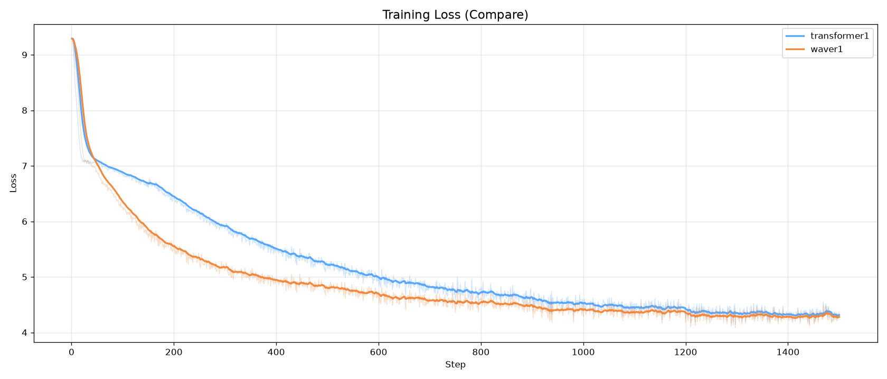
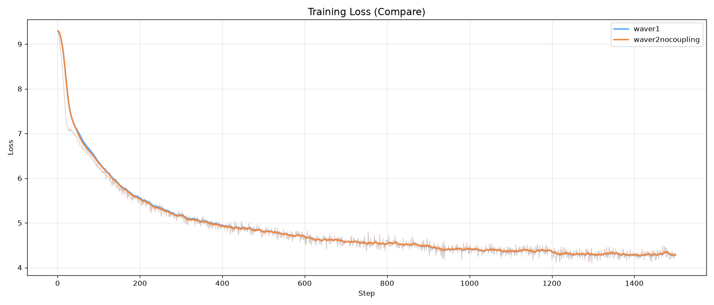

# Waver-SNN-SSM: 从脉冲到状态空间的统一序列建模框架

Waver-SNN-SSM 是一个从脉冲神经网络（SNN）出发，最终演进到与 Mamba-3 理念殊途同归的高效状态空间模型（SSM）实现。本项目将复值 SSM 的复数算子完整替换为实值 2×2 块同构，彻底移除了训练时的复数中间张量，从而安全启用 BF16 混合精度训练，大幅降低显存占用并加速训练。

---

📖 中文文档

## 📊 v2.0.0 对照实验

### 实验1：与经典 Transformer 基准对比

**数据集**：自制中文名著小说数据集（约 **15.36M tokens**，因词表调整，数据量较 v1 的 12.9M 有所增加）  
**控制变量**：完全相同的分词词表、训练数据集、优化器策略与全部超参数。  
**参数量**：Transformer 为 **9,479,154**（维度略高），Waver 为 **9,292,338**，Transformer 参数量占优。

**结论**：Waver 模型在训练全程损失下降更快，最终收敛损失低于 Transformer 基线，验证了状态空间架构与复数实值化的性能优势。

---

### 实验2：层内耦合（Coupling）开关对比

**目的**：验证可学习的子通道间耦合矩阵（斜埃尔米特结构）是否带来增益。  
**设置**：在相同 Waver 模型上，仅开关 `USE_COUPLING` 标志，其他完全一致（约 10M 参数）。  
**结果**：耦合开相比耦合关，在训练后期（过拟合风险出现时）仍保持微弱优势，**Loss 低约 0.006~0.02**（取决于步数），表明耦合结构有助于捕捉通道间交互信息。

---

## 🔥 最新更新 (v2.0 — 2026-09-09)
完整更新日志见 CHANGELOG。

### 🚀 核心性能优化
| 优化项 | 效果 |
|--------|------|
| Ω 特征分解 → 对角复扫描 | SSM 显存 755MB/层 → 126MB/层，提速 5-20× |
| 分块线性注意力 | 摘要器显存 ~1GB/层 → <1MB |
| 并行 Prefill | prompt 处理 1024 次 step → 1 次 forward，提速 10-50× |
| CUDA Graph 解码 | decode 提速 2-5×，与 eager 逐位 0 误差 |
| MoE 独立 Copy Stream | 训练步时 16s → 3-5s |
| MoE BF16 常驻 | 推理内存 2× 压缩，零反量化开销 |
| Blelloch 填充修复 | 扫描算量/显存直接减半 |

### 🐛 关键修复
- **Win11 DataLoader spawn 死锁**：`collate_fn`/`worker_init_fn` 改为顶层可 pickle，`num_workers>0` 不再必崩。
- **AMP + linear_attention 生成崩溃**：显式 fp32 上转 + autocast 块内计算 `S_final`，AMP+CUDA Graph 组合稳定运行。
- **COUPLING + MoE 既有 bug**：pin 循环容错 + 补 `MOE_EXPERT_WNORM=False`，COUPLING 家族 MoE 全路径可用。

## 📖 项目亮点
- **彻底的复数化（Complex-to-Real 2×2 块同构）**  
  在代数层面实现“无复数”的复数 SSM，安全开启 BF16 AMP 加速。每个复矩阵元 `a+bi` 被替换为实矩阵 `[[a, -b], [b, a]]`，实虚通道自然交替，无任何 complex 类型的中间张量。

- **可选的“读写头”（全局摘要器）**  
  独创 Mean / LinearAttention / MiniWave 三种全局摘要器，为 SSM 提供显式的全局信息参考，弥补 SSM 固有的上下文压缩局限。

- **更灵活的层内耦合（Intra-layer Coupling）**  
  内置可学习的子通道间耦合矩阵（斜埃尔米特结构），比 Mamba 的对角/标量矩阵更具表达力，状态通道间可交叉交互。

- **完整的 MoE 集成与工业级优化**  
  集成 MoE-FFN（SwiGLU 专家 + Top-K 路由），包含 Expert Offload（CPU 卸载）、独立 Copy Stream 异步搬运、FP8/NVFP4/BF16 量化、Weight Normalization 等全套优化方案。

- **“单文件 + 全配置”的工程化典范**  
  训练、推理、强化学习（GRPO/RL）全流程单文件封装，所有超参数均通过顶部常量集中控制，实验可复现性极强。

- **跨平台稳定**  
  Win11 / Linux / macOS 全平台支持，DataLoader 多 worker 在 spawn 模式下可安全使用（需 `if __name__ == "__main__"` 守卫）。

## 🚀 快速开始

### 1. 安装依赖

pip install -r requirements.txt
依赖项：

torch >= 2.0.0

numpy >= 1.24.0

tokenizers >= 0.13.0

psutil >= 5.9.0（可选，用于内存监控）

2. 准备数据
将你的训练数据（.txt 或 .jsonl 格式）放入项目根目录。

.txt 格式：纯文本语料，每行一个样本或连续文本，程序会自动滑动窗口切分。

.jsonl 格式：对话数据，格式为 {"conversations": [{"role": "user", "content": "..."}, {"role": "assistant", "content": "..."}]}。

3. 训练模型
bash
python 312003elite.py
然后根据菜单提示选择 1. 训练模型（继续训练），并选择你的数据集文件。

📊 训练状态
v1 (312002proplus_elite) 已完成：
数据集：52.1MB 中文名著语料，约 204,123 行，12.9M tokens，epoch1；
DeepSeek R1 蒸馏集（1万条，无思维链）5M tokens，epoch1；
百度百科额外训练几百步后中断。

v2 (312003elite.py) 对照实验已完成：
与 Transformer 对比（test1）及耦合开关对比（test2）均已结束，结果如上所示。
当前 v2 主程序尚未进行大规模预训练，欢迎在此基础上继续探索。

📌 为什么 Loss 看起来偏高？
这是一个 1.6B 参数模型在有限数据上的表现。参考 Chinchilla 定律，1.6B 模型最优数据量约 320 亿 token，而当前训练数据仅为最优值的 ~4%。在此极端数据‑参数比下，模型能将 Loss 从 ~10 降至 ~5，PPL 从 ~49000 降至 ~200，已是架构有效的有力证明。

📈 312002 训练曲线三段合集总览（v1）
https://./v1/plots/overview.png
https://./v1/plots/layer_stats.png
https://./v1/plots/mon_params.png

上图综合展示了 Loss、PPL、Activity、LR、Memory 的全流程变化，以及层统计与监控参数。
详细日志请见 v1/ 下各阶段子目录中的 training_log.txt。

⚙️ 核心组件
ParallelComplexWaveLayer
模型的核心，将复值 SSM 的所有算子替换为实值 2×2 块：

状态转移：h_t = A_disc @ h_{t-1} + b_t

并行扫描：使用自定义的 BlellochScanFn 实现高效的 O(log T) 并行前缀扫描。

特征分解加速（USE_EIG_SCAN=True）：将 exp(δΩ) 拆解为 P·diag(exp(δλ))·P⁻¹，矩阵扫描退化为复标量扫描。

全局摘要器 (Summarizer)
通过 SUMMARY_TYPE 切换三种模式：

mean：全局平均池化（无参数基线）。

linear_attention：可学习的线性注意力摘要，支持分块（SUMMARY_CHUNK）避免大张量物化。

mini_wave：迷你的 ParallelComplexWaveLayer 实例，独立参数。

MoE-FFN
集成了带有 SwiGLU 激活函数的混合专家模型：

MOE_OFFLOAD：专家权重可卸载到 CPU，按需搬移。

_copy_stream：独立 CUDA 流异步搬运，与计算重叠。

MOE_EXPERT_QUANT：支持 FP8（E4M3）训练量化、NVFP4（E2M1）推理量化、BF16 常驻推理。

MOE_EXPERT_WNORM：权重归一化，防止训练发散。

🔧 配置调优
所有关键参数均在文件头部定义，集中控制训练、推理、强化学习全流程。

 
📖 English Documentation

📊 v2.0.0 Controlled Experiments
Experiment 1: Comparison with Classic Transformer Baseline
Dataset: Custom Chinese classic novel corpus (approx. 15.36M tokens, adjusted due to smaller vocabulary, vs. 12.9M in v1)
Controls: Same tokenizer, dataset, optimizer, and hyperparameters.
Parameters: Transformer 9,479,154 (larger dimension), Waver 9,292,338 – Transformer has more parameters.

https://./v2/compare/test1/result/loss.png

Conclusion: Waver converges faster and achieves lower final loss, demonstrating the superiority of our state-space architecture and complex-to-real reconstruction.

Experiment 2: Coupling On/Off Comparison
Purpose: Verify whether the learnable intra‑layer coupling (skew‑Hermitian) brings benefits.
Setup: Same Waver model, only toggle USE_COUPLING, everything else identical (≈10M parameters).
Result: With coupling on, the model maintains a slight advantage even in the overfitting‑prone later stage, Loss lower by ~0.006–0.02 (step‑dependent), indicating that coupling helps capture inter‑channel interactions.

https://./v2/compare/test2nocoupling/compare_plots/loss.png

🔥 Latest Updates (v2.0 — 2026-09-09)
See CHANGELOG for full release notes.

🚀 Core Performance Optimizations
Optimization	Effect
Ω eigendecomposition → diagonal complex scan	SSM memory 755MB/layer → 126MB/layer, 5-20× speedup
Blockwise linear attention	Summarizer memory ~1GB/layer → <1MB
Parallel Prefill	prompt processing from 1024 steps → 1 forward, 10-50× faster
CUDA Graph decoding	2-5× decode speedup, bit-exact with eager
MoE independent Copy Stream	training step 16s → 3-5s
MoE BF16 resident	2× inference memory compression, zero dequantization overhead
Blelloch padding fix	scan compute/memory halved
🐛 Key Fixes
Win11 DataLoader spawn deadlock: collate_fn/worker_init_fn made top-level picklable, num_workers>0 no longer guaranteed to crash.

AMP + linear_attention generation crash: explicit fp32 upcast + compute S_final inside autocast block, stable under AMP+CUDA Graph.

COUPLING + MoE existing bugs: pin loop fault tolerance + add MOE_EXPERT_WNORM=False, full path usable for COUPLING family MoE.

📖 Highlights
Complete Complex-to-Real 2×2 Block Isomorphism
Algebraically realizes a "complex-free" complex SSM, safely enabling BF16 AMP acceleration. Each complex entry a+bi is replaced by real matrix [[a, -b], [b, a]], with real/imaginary channels naturally interleaved and no complex intermediate tensors.

Optional Global Summarizers (Read/Write Heads)
Novel Mean / LinearAttention / MiniWave global summarizers provide explicit global context for SSM, compensating for its inherent context compression limits.

Flexible Intra-layer Coupling
Built-in learnable inter-subchannel coupling matrices (skew-Hermitian structure), more expressive than Mamba's diagonal/scalar matrices, enabling cross-interaction among state channels.

Full MoE Integration with Industrial-Grade Optimizations
MoE-FFN (SwiGLU experts + Top-K routing) with Expert Offload (CPU), asynchronous copy streams, FP8/NVFP4/BF16 quantization, Weight Normalization, and more.

"Single File + Full Configuration" Engineering Paradigm
Training, inference, and reinforcement learning (GRPO/RL) are encapsulated in a single file, all hyperparameters centrally controlled by top-level constants for strong reproducibility.

Cross-Platform Stability
Win11 / Linux / macOS all supported. DataLoader with multiple workers works safely in spawn mode (requires if __name__ == "__main__" guard).

🚀 Quick Start
1. Install Dependencies
bash
pip install -r requirements.txt
Dependencies:

torch >= 2.0.0

numpy >= 1.24.0

tokenizers >= 0.13.0

psutil >= 5.9.0 (optional, for memory monitoring)

2. Prepare Data
Place your training data (.txt or .jsonl) in the project root.

.txt: plain text corpus, one sample per line or continuous text, auto sliding-window split.

.jsonl: conversational data, format {"conversations": [{"role": "user", "content": "..."}, {"role": "assistant", "content": "..."}]}.

3. Train Model
bash
python 312003elite.py
Then follow the menu prompt and select 1. Train model (continue training), choose your dataset file.

📊 Training Status
v1 (312002proplus_elite) completed:
Dataset: 52.1MB Chinese classics, ~204,123 lines, 12.9M tokens, epoch1;
DeepSeek R1 distilled set (10k samples, no CoT) 5M tokens, epoch1;
Extra Baidu Baike training interrupted after a few hundred steps.

v2 (312003elite.py) controlled experiments completed:
Both Transformer comparison (test1) and coupling on/off (test2) are finished, results shown above.
The main v2 program has not yet undergone large‑scale pretraining – feel free to continue exploring.

📌 Why Does the Loss Look High?
This is a 1.6B parameter model trained on limited data. According to Chinchilla scaling laws, the optimal data for 1.6B is ~32B tokens; current data is only ~4% of that. Under such extreme data‑parameter ratio, the model’s ability to stably reduce Loss from ~10 to ~5 and PPL from ~49,000 to ~200 is itself strong evidence of architectural effectiveness.

📈 312002 Training Curves – Three‑Segment Combined Overview (v1)
https://./v1/plots/overview.png
https://./v1/plots/layer_stats.png
https://./v1/plots/mon_params.png

The figures show Loss, PPL, Activity, LR, Memory over the full process, plus layer stats and monitored parameters.
Full logs: see training_log.txt in each stage subdirectory under v1/.

⚙️ Core Components
ParallelComplexWaveLayer
The core of the model, replacing all complex-valued SSM operators with real 2×2 blocks:

State transition: h_t = A_disc @ h_{t-1} + b_t

Parallel scan: custom BlellochScanFn for efficient O(log T) parallel prefix scan.

Eigendecomposition acceleration (USE_EIG_SCAN=True): decompose exp(δΩ) into P·diag(exp(δλ))·P⁻¹, matrix scan reduces to complex scalar scan.

Global Summarizer
Switch via SUMMARY_TYPE:

mean: global average pooling (parameter-free baseline).

linear_attention: learnable linear attention summary, supports chunking (SUMMARY_CHUNK) to avoid materializing large tensors.

mini_wave: miniature ParallelComplexWaveLayer instance with independent parameters.

MoE-FFN
Mixture-of-Experts with SwiGLU activation:

MOE_OFFLOAD: expert weights offloaded to CPU, loaded on demand.

_copy_stream: independent CUDA stream for asynchronous transfer, overlapping with computation.

MOE_EXPERT_QUANT: supports FP8 (E4M3) training quantization, NVFP4 (E2M1) inference quantization, BF16 resident inference.

MOE_EXPERT_WNORM: weight normalization to prevent training divergence.

🔧 Configuration Tuning
All key parameters are defined at the top of the file, centrally controlling training, inference, and reinforcement learning.

📜 引用 / Citation
bibtex
@misc{zeng2026waversnnssm,
  author = {Zeng, Naiqi},
  title = {Waver-SNN-SSM: From Spiking Neurons to State Space Models},
  year = {2026},
  publisher = {Zenodo},
  doi = {10.5281/zenodo.22309186},
  url = {https://doi.org/10.5281/zenodo.22309186}
}
📧 联系方式 / Contact
ORCID: 0009-0006-4332-1295

Email: X005_0001_0001@163.com

📄 许可证 / License
本项目采用 GNU General Public License v3.0。任何使用、修改或分发本代码的行为，都必须遵守 GPL-3.0 的条款，即任何衍生作品也必须以 GPL-3.0 开源。
This project is licensed under the GNU General Public License v3.0. Any use, modification, or distribution of this code must comply with GPL-3.0 terms, meaning any derivative work must also be open-sourced under GPL-3.0.

⚠️ 版权声明 / Copyright
Copyright © 2026 Naiqi Zeng. All rights reserved.
本代码及相关文档的首次公开发布时间由 Zenodo DOI 10.5281/zenodo.22309186 锁定。任何未经授权的抄袭、洗稿或未注明来源的引用，均视为侵犯版权。本项目的 GPL-3.0 许可证明确要求任何二次分发必须公开源代码，商业用途必须获得额外授权。

Version: 2.0.0
Last Updated: 2026-09-08
