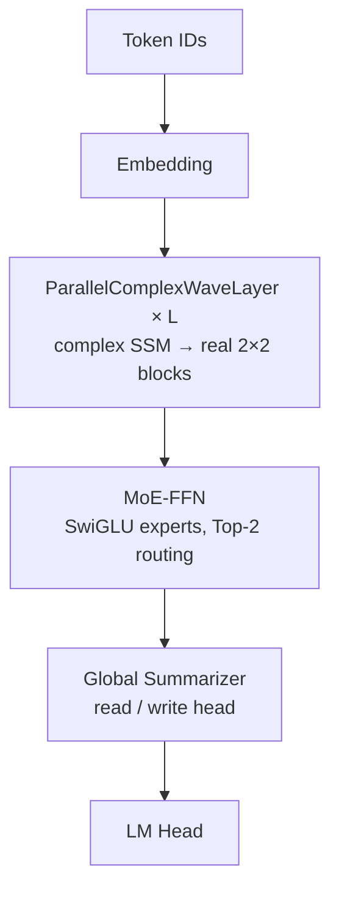

# Waver-SNN-SSM：从脉冲到状态空间的统一序列建模框架

[](https://doi.org/10.5281/zenodo.22309186)
[](https://orcid.org/0009-0006-4332-1295)
[](https://www.gnu.org/licenses/gpl-3.0)
[](https://www.python.org/downloads/)
[](https://pytorch.org/)

**A complex-valued SSM turned "complex-free": every complex operator is replaced by a real 2×2 block isomorphism.**
**把复值 SSM 的复数算子完整替换为实值 2×2 块同构 —— 代数层面实现"无复数"的复数 SSM。**

> **当前最新 / Latest：`7.0.3`（2026-10-11）** —— 修复 CUDA Graph 解码 × AMP 的生成崩溃（承接 7.0.2 的切分/日志补丁与 7.0.0 的训练步 CUDA Graph + 8-bit AdamW）。

**语言 / Language：** [中文文档](#中文文档) · [English Documentation](#english-documentation)

---

<a name="中文文档"></a>

# 中文文档

## 📌 项目简介

Waver-SNN-SSM 是一个从脉冲神经网络（SNN）出发、最终与 Mamba-3 理念殊途同归的高效状态空间模型（SSM）实现。核心创新在于把复值 SSM 的复数算子完整替换为**实值 2×2 块同构**，在代数层面实现"无复数"的复数 SSM，从而安全启用 BF16 混合精度训练，大幅降低显存占用并加速训练。

## 🧭 架构总览


```mermaid
flowchart TD
    A["Token IDs"] --> B["Embedding"]
    B --> C["ParallelComplexWaveLayer × L<br/>complex SSM → real 2×2 blocks"]
    C --> D["MoE-FFN<br/>SwiGLU experts, Top-2 routing"]
    D --> E["Global Summarizer<br/>read / write head"]
    E --> F["LM Head"]
```

核心状态方程（唯一路径）：

```
h_t = A_t @ h_{t-1} + b_t          # 并行前缀扫描
A_t = matrix_exp(δ_t · Ω_t)        # 实值 2×2 块矩阵指数
Ω_t = M + diag(-ν + i·(θ_base + θ_delta_t))
```

- `M`：可学习子通道耦合（斜埃尔米特结构），比对角 / 标量矩阵更具表达力
- 稳定性由 **Bendixson 定理**结构性保证（`Re Ω < 0`），不依赖任何阈值
- `iθ` 项天然提供位置编码（等价 RoPE），无需额外的正弦位置编码

## 🗂 仓库结构

```
Waver-SNN-SSM/
├── v1/          # 早期 1.6B 训练快照（312002proplus_elite）
├── v2/          # 312003elite + 与 Transformer 的受控对照
├── v3.1/        # 统一 matrix_exp 实值矩阵扫描（312003elite）
├── v4/          # Loop 机制 + SSM 分块扫描（312004elite）
├── v4.1/        # 稳定性更新与受控对照（310004elite）
├── v4.2/        # jsonl 显存碎片修复（312004elite）
├── v5/          # v5 数据格式层（312005elite / 312505elite）
├── v6/          # 闭式矩阵指数 + 批量分词（312006elite / 312506elite）
├── v7/          # 训练步 CUDA Graph + 8-bit AdamW（312007elite / 312507elite）
├── compare/     # 对照实验：round3 全套图 + v6 验证报告 + 看板工具
├── count_tokens.py / plot_training.py / plot_watch.py / overview_viewer.html
├── tokenizer_incremental.bin / tokenizer_incremental_tokenizer.json
└── README.md / CHANGELOG.md / LICENSE / CITATION.cff / DOI.txt
```

**命名规则**：`312005elite.py` 为主族（层内耦合），`312505elite.py` 为 x25 族（层外耦合）。**v5 起两族同时发布**；v4 及以前仅发布 `31200x`。每个 `.py` 均为**单文件**、自包含全流程（训练 / 推理 / 强化学习）。

## 📜 版本历史

| 版本 | 日期 | 核心变更 |
|---|---|---|
| 1.0.0 | 2026-09-05 | 首次公开发布：复值 SSM 实值化 2×2 块同构、MoE-FFN、全局摘要器、自定义 Blelloch 并行前缀扫描 |
| 1.0.1 | 2026-09-05 | FastBPE 逐 token 性能修复（`_vocab_size_cache`）|
| 1.0.2 | 2026-09-05 | `brain.pt` 惰性加载，聊天不再触发 OOM |
| 2.0.0 | 2026-09-09 | 性能优化与工程加速：Blelloch 填充修复、Ω 对角复扫描、分块线性注意力、并行 Prefill、CUDA Graph 解码、MoE 独立 Copy Stream / BF16 常驻 |
| 3.1.0 | 2026-09-17 | 架构重构：统一 `A_t = matrix_exp(δ_t·Ω_t)` 实值矩阵扫描，删除 eig 路径，δ 逐通道化，新增数据依赖旋转 `theta_delta` |
| 4.0.0 | 2026-09-23 | Loop 机制（权重共享循环层）+ SSM 分块扫描 `SSM_CHUNK_SIZE` |
| 4.1.0 | 2026-09-28 | 稳定性更新 + 与经典 Transformer 的受控对照（层内耦合开 / 关）|
| 4.2.0 | 2026-10-02 | 修复 jsonl 路径显存碎片 |
| 5.0.0 | 2026-10-04 | 数据格式层（messages / reasoning_content / tool_calls）+ 词表 / 分词修复 + 配置精简 |
| 6.0.0 | 2026-10-10 | 闭式矩阵指数（K=2）+ 批量分词 + 解码 CUDA Graph 默认启用 |
| **7.0.3** | **2026-10-11** | **修复 CUDA Graph 解码 × AMP 生成崩溃（autocast 缓存冲突）** |
| 7.0.2 | 2026-10-10 | 菜单 11 切分保留 system 段 + 切分长度对齐 + 日志降噪 |
| 7.0.1 | 2026-10-10 | 修复 system 段丢失 + 以 user 结尾样本护栏 |
| 7.0.0 | 2026-10-10 | 训练步 CUDA Graph + 8-bit AdamW + 矩阵指数开关集中化 |

## 🚀 7.0.3 核心变更

> 定位：v7 的**生成路径正确性补丁** —— 修复启用 `USE_CUDA_GRAPH_DECODE` 时，菜单 2 对话在 AMP（bf16）下生成若干步后崩溃的问题；不改动模型结构 / 优化器 / 数值路径。

- **CUDA Graph 解码 × autocast 缓存冲突**：`generate` 原先让 `prefill` 与每一步解码各自单独进出 `torch.amp.autocast`。抓图前的预热在 autocast 内执行，会把 bf16 权重副本写入 autocast 缓存；随后的抓图直接复用这些缓存张量、未记录 cast 算子；而退出最外层 autocast 会触发 `clear_autocast_cache()` 释放这些副本 —— 图回放便读到已被复用的显存，数值发散产生 NaN/Inf 非法分布，最终 `torch.multinomial` 触发设备端断言、进程硬崩。
- **修复方式**：把整个 `prefill` + 逐 token 解码循环保持在**同一个** autocast 上下文内，不再每步单独进出。autocast 缓存全程存活，抓图烘焙的 bf16 权重始终有效。
- **验证**：同一 checkpoint（seed=0）下，7.0.2 开启图解码必崩；修复后正常生成无异常；固定 token 序列上「图解码 vs eager」logits 最大绝对误差为 **0.0**（逐位一致）。

### 7.0.2 数据预处理与日志降噪

> 定位：v7 的**数据预处理与日志降噪补丁** —— 修复菜单 11 切分后 system 段丢失、对齐切分长度口径，并消除无 triton 环境下的无害告警；不改动模型结构 / 优化器 / 数值路径。

- **菜单 11 切分保留 system 段**：`p4_segment_dataset` 按 `(user, assistant)` 对切分时会把对话开头的连续 `system` 段丢弃，与训练路径 `_truncate_pairs` 语义不一致。现改为先摘出开头连续 `system` 段并计入 token 预算，切分后拼接到每条样本前（`{'messages': head + list(pair)}`），保证 system 在多轮切分后仍可见。
- **切分长度口径对齐**：`pair_tokens` 补上真实样本长度的 `+1`（`input_ids = tokens[:-1]`），避免边界样本多留一条，与训练侧长度口径一致。
- **日志降噪**：`bitsandbytes` 导入会顺带导入 `torch.utils.flop_counter`，在无 triton 的 CUDA 环境下打一条 `triton not found; flop counting will not work for triton kernels` 的 WARNING。现将其 logger 降至 ERROR（纯降噪，不影响任何功能）。

### 7.0.1 数据管线修复

> 定位：v7 的**数据管线正确性补丁** —— 修复训练样本中 system 段丢失、以及残缺样本污染生成行为两处问题；不改动模型结构 / 优化器 / 数值路径。

- **修复 system 消息丢失**：`_truncate_pairs` 只识别相邻 `(user, assistant)` 对，会把对话开头的连续 `system` 段整段丢弃（`render_messages` 支持 system、训练语料里却永远看不到 system）。现改为先把开头连续 system 段原样摘出并计入 token 预算，再从尾部取 `(user, assistant)` 对合并返回。
- **以 user 结尾样本的护栏**：仅含 user（或 system + user）、无任何 assistant 回复的残缺样本，其唯一训练目标只剩结尾的 `<|eos|>`，会污染生成行为。新增 `_has_assistant_target` 护栏，`StreamingJSONLDataset` 迭代时跳过此类样本。

### 7.0.0 基础（无损加速 + 降显存）

> 定位：v7 是 v6 的**训练侧「无损加速 + 降显存」版本** —— 所有新增开关默认启用、失败自动回退、数学逐位一致。

- **训练步 CUDA Graph** `USE_TRAIN_STEP_CUDA_GRAPH`：把训练步的 **fwd + bwd** 抓成 CUDA Graph（按序列长度分桶缓存，`TRAIN_GRAPH_BUCKET` / `TRAIN_GRAPH_MAX_GRAPHS`），消除每步约 10 万次 kernel 启动开销。`optimizer.step()` / `scheduler.step()` / 梯度裁剪留在图外；仅 CUDA + 非 MoE + batch=1 生效，抓图失败自动回退 eager（**仅性能回退，数学不变**）。
- **8-bit AdamW** `USE_ADAMW8BIT`：主训练优化器改用 bitsandbytes `AdamW8bit`（8-bit 动量状态），约省 **36%** 优化器显存；非 CUDA 或未安装 bitsandbytes 时自动回退本文件原生优化器（Adafactor / AdamW）。
- **矩阵指数 / 抓图开关集中化**：统一放在文件头部。新增 `USE_CAPTURABLE_EXPM`（K>2 走「缩放-平方 + Taylor 级数」，纯 matmul / 逐元素、无 LAPACK，可被 CUDA Graph 捕获；**默认关闭**，K>2 默认回退 `torch.linalg.matrix_exp`）。
- **梯度检查点默认开启**；loss 缩放与 `zero_grad(set_to_none=False)` 适配训练图。
- 精简对照实验纳入 `compare/`；README 重写 + 新增 `CHANGELOG.md`。

## 📖 核心特性

- **彻底的复数化（Complex-to-Real 2×2 块同构）**
  每个复矩阵元 `a+bi` 被替换为实矩阵 `[[a, -b], [b, a]]`，实虚通道自然交替，**无任何 complex 中间张量**，可安全开启 BF16 AMP。
- **可选的全局摘要器（读写头）**
  `Mean` / `LinearAttention` / `MiniWave` 三种全局摘要器，为 SSM 提供显式全局信息，弥补其固有的上下文压缩局限。
- **更灵活的层内耦合（Intra-layer Coupling）**
  内置可学习的子通道间耦合矩阵（斜埃尔米特结构），比 Mamba 的对角 / 标量矩阵更具表达力。
- **完整的 MoE 集成与工业级优化**
  MoE-FFN（SwiGLU 专家 + Top-K 路由），含 Expert Offload（CPU 卸载）、独立 Copy Stream 异步搬运、FP8 / NVFP4 / BF16 量化、Weight Normalization。
- **单文件 + 全配置**
  训练、推理、强化学习（GRPO / RL）全流程单文件封装，所有超参数由文件头部常量集中控制。
- **跨平台稳定**
  Win11 / Linux / macOS 全平台支持，DataLoader 多 worker 在 spawn 模式下可安全使用。

## ⚙️ 核心组件

### ParallelComplexWaveLayer
模型核心，将复值 SSM 的所有算子替换为实值 2×2 块：

- 状态转移：`h_t = A_t @ h_{t-1} + b_t`
- 唯一路径：`A_t = matrix_exp(δ_t · Ω_t)`，其中 `Ω_t = M + diag(-ν + i·(θ_base + θ_delta_t))`
- 并行扫描：自定义 `BlellochScanFn` 实现 O(log T) 并行前缀扫描，前向 / 反向均可并行
- 稳定性由 **Bendixon 定理**结构性保证（`Re Ω < 0`），不依赖任何阈值

### 全局摘要器（Summarizer）
通过 `SUMMARY_TYPE` 切换：
- `mean`：全局平均池化（无参数基线）
- `linear_attention`：可学习的线性注意力摘要，支持分块（`SUMMARY_CHUNK`）避免大张量物化
- `mini_wave`：迷你 `ParallelComplexWaveLayer` 实例，独立参数

### MoE-FFN
SwiGLU 混合专家：
- `MOE_OFFLOAD`：专家权重可卸载到 CPU，按需搬移
- `_copy_stream`：独立 CUDA 流异步搬运，与计算重叠
- `MOE_EXPERT_QUANT`：支持 FP8（E4M3）训练量化、NVFP4（E2M1）推理量化、BF16 常驻推理
- `MOE_EXPERT_WNORM`：权重归一化，防止训练发散

## 📊 对照实验（含图）

全部结果由 `对照测试/` 的原始训练日志**重新解析生成**，复现脚本与完整图集见 [`compare/`](./compare/)。
统一条件：**同词表 / 同优化器 / 同超参数**，`H=256, L=3, T=2048, batch=1, lr=1e-3`，约 8.9 万步。

### 1. 第 3 轮受控对照：Waver / x25 vs 经典 Transformer

三联图（训练 Loss · 验证 PPL · 相对基线 Loss 差值）：


> Waver v4.2 / x25 的训练 Loss 整体**略低于** Transformer 基线，验证 PPL 高度接近。

**多 seed 稳定性**（各 5 个 seed：42 / 43 / 114514 / 1919810 / 31415926）：


> Waver 的验证 PPL 在 5 个 seed 上**高度稳定**（31.1–31.6），Transformer 波动明显更大（22.3–30.0）。

**消融与扫描**（完整 14 图见 [`compare/round3/`](./compare/round3/)）：

| 学习率扫描（Waver） | 层内耦合系数消融 | 状态维度 K=4 |
|---|---|---|
|  |  |  |

> `lr=8e-3` 时明显恶化（印证复值 SSM 对过高学习率的敏感性）；完全去掉层内耦合后 loss 抬升约 0.05，耦合系数过大（2.718）同样变差——**适度耦合最优**。
> 其余消融：Loop 循环层、h368 更宽隐藏层、Warmup、摘要器 dk、10 万条数据 —— 详见目录。

### 2. v1 1.6B 模型训练总览


> 1.6B 参数模型在约 17.9M tokens（远低于 Chinchilla 最优）下，Loss 从 ~10 稳定降至 ~5，PPL 从 ~49000 降至 ~200 —— 架构有效性的有力证据。

### 3. v6 低精度 + 训练侧加速验证（RTX 5080 16GB）

| 结论 | 数据 |
|---|---|
| 8-bit AdamW 稳定性 | 全程 MON 指标相对偏差 < 3.4e-3（bf16 量化噪声量级），无漂移 |
| 8-bit AdamW 显存 | 优化器显存 **-35.7%**（421.7MB → 271.1MB）|
| FP8 / NVFP4 专家量化 | NVFP4 推理省 **45.6%** 显存，logits 相对误差仅 2e-4 |
| 训练步 CUDA Graph | fwd+bwd 抓图 **2.4–2.6×**；关梯度检查点 + 抓图合计约 **3.4×** |

完整报告与探针脚本见 [`compare/v6/`](./compare/v6/) 与 [`compare/README.md`](./compare/README.md)。

## 🔧 使用

每个版本目录下的 `.py` 即为完整程序，直接运行进入菜单：

```bash
python v7/312007elite.py
```

所有关键参数（模型结构、优化器、数据路径、MoE、显存优化等）均在文件头部集中定义。

---

## 📜 引用 / Citation

```bibtex
@misc{zeng2026waversnnssm,
  author = {Zeng, Naiqi},
  title = {Waver-SNN-SSM: From Spiking Neurons to State Space Models},
  year = {2026},
  publisher = {Zenodo},
  doi = {10.5281/zenodo.22309186},
  url = {https://doi.org/10.5281/zenodo.22309186}
}
```

## 📧 联系方式 / Contact
- ORCID: [0009-0006-4332-1295](https://orcid.org/0009-0006-4332-1295)
- Email: X005_0001_0001@163.com

## 📄 许可证 / License
本项目采用 **GNU General Public License v3.0**。任何使用、修改或分发本代码的行为，都必须遵守 GPL-3.0 的条款，即任何衍生作品也必须以 GPL-3.0 开源。

## ⚠️ 版权声明 / Copyright
Copyright © 2026 Naiqi Zeng. All rights reserved.
本代码及相关文档的首次公开发布时间由 Zenodo DOI 10.5281/zenodo.22309186 锁定。任何未经授权的抄袭、洗稿或未注明来源的引用，均视为侵犯版权。

---

<a name="english-documentation"></a>

# English Documentation

## 📌 Overview

Waver-SNN-SSM starts from spiking neural networks (SNN) and evolves into an efficient state-space model (SSM) that converges, by a different route, with the ideas behind Mamba-3. Its core innovation is replacing every complex operator of a complex-valued SSM with a **real 2×2 block isomorphism** — a "complex-free" complex SSM at the algebraic level — which safely unlocks BF16 mixed-precision training and substantially reduces memory usage while accelerating training.

## 🧭 Architecture


```mermaid
flowchart TD
    A["Token IDs"] --> B["Embedding"]
    B --> C["ParallelComplexWaveLayer × L<br/>complex SSM → real 2×2 blocks"]
    C --> D["MoE-FFN<br/>SwiGLU experts, Top-2 routing"]
    D --> E["Global Summarizer<br/>read / write head"]
    E --> F["LM Head"]
```

Core state dynamics (single unified path):

```
h_t = A_t @ h_{t-1} + b_t          # parallel prefix scan
A_t = matrix_exp(δ_t · Ω_t)        # real 2×2 block matrix exponential
Ω_t = M + diag(-ν + i·(θ_base + θ_delta_t))
```

- `M`: learnable inter-subchannel coupling (skew-Hermitian), more expressive than diagonal/scalar matrices
- Stability is structurally guaranteed by the **Bendixson theorem** (`Re Ω < 0`), with no thresholds
- The `iθ` term natively provides positional encoding (equivalent to RoPE); no separate sinusoidal PE is needed

## 🗂 Repository Layout

```
Waver-SNN-SSM/
├── v1/          # early 1.6B training snapshots (312002proplus_elite)
├── v2/          # 312003elite + controlled comparison vs. Transformer
├── v3.1/        # unified matrix_exp real-matrix scan (312003elite)
├── v4/          # Loop mechanism + chunked SSM scan (312004elite)
├── v4.1/        # stability update + controlled comparison (310004elite)
├── v4.2/        # jsonl memory-fragmentation fix (312004elite)
├── v5/          # v5 data-format layer (312005elite / 312505elite)
├── v6/          # closed-form matrix exponential + batched tokenization (312006elite / 312506elite)
├── v7/          # training-step CUDA Graph + 8-bit AdamW (312007elite / 312507elite)
├── compare/     # comparison: round3 figure set + v6 report + dashboards
├── count_tokens.py / plot_training.py / plot_watch.py / overview_viewer.html
├── tokenizer_incremental.bin / tokenizer_incremental_tokenizer.json
└── README.md / CHANGELOG.md / LICENSE / CITATION.cff / DOI.txt
```

**Naming**: `312005elite.py` is the main family (intra-layer coupling); `312505elite.py` is the x25 family (inter-layer coupling). **Both families ship from v5 onward**; v4 and earlier ship only `31200x`. Every `.py` is a **single self-contained file** covering training / inference / RL.

## 📜 Version History

| Version | Date | Highlights |
|---|---|---|
| 1.0.0 | 2026-09-05 | First public release: complex SSM as real 2×2 blocks, MoE-FFN, global summarizers, custom Blelloch parallel prefix scan |
| 1.0.1 | 2026-09-05 | FastBPE per-token performance fix (`_vocab_size_cache`) |
| 1.0.2 | 2026-09-05 | Lazy `brain.pt` loading; chat no longer triggers OOM |
| 2.0.0 | 2026-09-09 | Performance & engineering: Blelloch padding fix, Ω eigendecomposition → diagonal complex scan, chunked linear attention, parallel prefill, CUDA Graph decoding, MoE dedicated copy stream / BF16 residency |
| 3.1.0 | 2026-09-17 | Architecture refactor: unified `A_t = matrix_exp(δ_t·Ω_t)` real-matrix scan, removed the eig path, per-channel δ, data-dependent rotation `theta_delta` |
| 4.0.0 | 2026-09-23 | Loop mechanism (weight-shared recurrent layers) + chunked SSM scan `SSM_CHUNK_SIZE` |
| 4.1.0 | 2026-09-28 | Stability update + controlled comparison vs. a classic Transformer (coupling on/off) |
| 4.2.0 | 2026-10-02 | jsonl memory-fragmentation fix |
| 5.0.0 | 2026-10-04 | v5 data-format layer (messages / reasoning_content / tool_calls) + tokenizer fixes + config cleanup |
| 6.0.0 | 2026-10-10 | Closed-form matrix exponential (K=2) + batched tokenization + CUDA Graph decoding on by default |
| **7.0.3** | **2026-10-11** | **Fix CUDA Graph decoding × AMP generation crash (autocast-cache conflict)** |
| 7.0.2 | 2026-10-10 | Menu 11 segmentation keeps the system span + aligned segmentation length + log-noise cleanup |
| 7.0.1 | 2026-10-10 | Fix dropped system span + guard for user-ending samples |
| 7.0.0 | 2026-10-10 | Training-step CUDA Graph + 8-bit AdamW + centralized matrix-exponential switches |

## 🚀 What's New in 7.0.3

> v7.0.3 is a **generation-path correctness patch** over v7.0.2 — it fixes a crash in menu 2 chat under AMP (bf16) when `USE_CUDA_GRAPH_DECODE` is enabled; the model architecture, optimizers and numerical paths are untouched.

- **CUDA Graph decoding × autocast-cache conflict**: `generate` used to enter/exit `torch.amp.autocast` separately for `prefill` and for every decode step. The pre-capture warmup ran inside autocast and cached bf16 weight copies; the subsequent capture then aliased those cached tensors instead of recording cast ops; exiting the outermost autocast triggered `clear_autocast_cache()`, freeing them — so graph replay read already-reused memory, diverged to NaN/Inf distributions, and `torch.multinomial` hit a device-side assert that hard-crashed the process.
- **Fix**: keep the entire `prefill` + per-token decode loop inside **one** autocast context instead of entering/exiting per step. The autocast cache stays alive throughout, so the bf16 weights baked into the graph remain valid.
- **Verification**: with the same checkpoint (seed=0), 7.0.2 crashes deterministically with graph decoding on; the fixed build generates normally. On a fixed token sequence, the max absolute logit difference between graph decoding and eager is **0.0** (bit-identical).

### 7.0.2 data-preprocessing and log-noise

> v7.0.2 is a **data-preprocessing and log-noise patch** over v7.0.1 — it fixes the dropped `system` span in menu 11 segmentation, aligns the segmentation length accounting, and silences a harmless warning in triton-less environments; the model architecture, optimizers and numerical paths are untouched.

- **Menu 11 segmentation keeps the `system` span**: `p4_segment_dataset` split conversations into `(user, assistant)` pairs and discarded the leading contiguous `system` span, inconsistent with the training path `_truncate_pairs`. It now lifts the leading `system` span out first, counts it into the token budget, and prepends it to every segmented sample (`{'messages': head + list(pair)}`), so the system prompt survives multi-turn segmentation.
- **Aligned segmentation length**: `pair_tokens` now includes the `+1` of the real sample length (`input_ids = tokens[:-1]`), preventing an extra boundary sample from being kept, matching the training-side length accounting.
- **Log-noise cleanup**: importing `bitsandbytes` transitively imports `torch.utils.flop_counter`, which logs a `triton not found; flop counting will not work for triton kernels` WARNING on CUDA without triton. Its logger is now raised to ERROR (pure de-noising; no functional change).

### 7.0.1 data-pipeline fix

> v7.0.1 is a **data-pipeline correctness patch** over v7.0.0 — it fixes the dropped `system` span and the pollution of generation behavior by incomplete samples; the model architecture, optimizers and numerical paths are untouched.

- **Fix dropped `system` messages**: `_truncate_pairs` only recognized adjacent `(user, assistant)` pairs and discarded any leading contiguous `system` span (`render_messages` supported system, yet training data never saw it). It now lifts the leading `system` span out first, counts it into the token budget, then takes `(user, assistant)` pairs from the tail and merges.
- **Guard for user-ending samples**: incomplete samples that only contain user (or system + user) with no assistant reply leave the trailing `<|eos|>` as the sole training target, which pollutes generation behavior. A new `_has_assistant_target` guard makes `StreamingJSONLDataset` skip such samples during iteration.

### 7.0.0 base (lossless speedup + memory reduction)

> v7 is the **training-side "lossless speedup + memory reduction"** release over v6 — every new switch is on by default, falls back automatically on failure, and stays mathematically bit-identical.

- **Training-step CUDA Graph** `USE_TRAIN_STEP_CUDA_GRAPH`: captures the training step's **forward + backward** into a CUDA Graph (bucketed by sequence length via `TRAIN_GRAPH_BUCKET` / `TRAIN_GRAPH_MAX_GRAPHS`), eliminating ~100k kernel launches per step. `optimizer.step()` / `scheduler.step()` / gradient clipping stay outside the graph; active only on CUDA + non-MoE + batch=1, with automatic eager fallback on capture failure (**performance-only fallback; math unchanged**).
- **8-bit AdamW** `USE_ADAMW8BIT`: switches the main optimizer to bitsandbytes `AdamW8bit` (8-bit momentum states), saving ~**36%** optimizer memory; automatically falls back to the file's native optimizer (Adafactor / AdamW) when unavailable or non-CUDA.
- **Centralized matrix-exponential / graph switches** at the top of each file. Adds `USE_CAPTURABLE_EXPM` (K>2 uses "scaling-and-squaring + Taylor series", pure matmul/elementwise, no LAPACK, CUDA-Graph-capturable; **off by default**, K>2 falls back to `torch.linalg.matrix_exp`).
- **Gradient checkpointing on by default**; loss scaling and `zero_grad(set_to_none=False)` adapted to the training graph.
- Curated comparison experiments moved into `compare/`; README rewritten + new `CHANGELOG.md`.

## 📖 Key Features

- **Truly complex-free (Complex-to-Real 2×2 block isomorphism)**
  Each complex entry `a+bi` becomes the real matrix `[[a, -b], [b, a]]`, so real/imaginary channels alternate naturally with **no complex intermediate tensors** — BF16 AMP is safe.
- **Optional global summarizers (read/write heads)**
  `Mean` / `LinearAttention` / `MiniWave` summarizers give the SSM explicit global information, compensating for its inherent context-compression limits.
- **Flexible intra-layer coupling**
  A learnable inter-subchannel coupling matrix (skew-Hermitian) is more expressive than Mamba's diagonal/scalar matrices.
- **Full MoE integration with production-grade optimizations**
  MoE-FFN (SwiGLU experts + Top-K routing) with expert offload, a dedicated copy stream, FP8 / NVFP4 / BF16 quantization, and weight normalization.
- **Single file + all-config**
  Training, inference and RL (GRPO) in one self-contained file; every hyperparameter is a top-of-file constant.
- **Cross-platform stability**
  Win11 / Linux / macOS; DataLoader with multiple workers works safely under the spawn start method.

## ⚙️ Core Components

### ParallelComplexWaveLayer
The model core, replacing all complex-SSM operators with real 2×2 blocks:

- State transition: `h_t = A_t @ h_{t-1} + b_t`
- Single path: `A_t = matrix_exp(δ_t · Ω_t)`, where `Ω_t = M + diag(-ν + i·(θ_base + θ_delta_t))`
- Parallel scan: a custom `BlellochScanFn` gives an O(log T) parallel prefix scan (parallel in both forward and backward)
- Stability structurally guaranteed by the **Bendixson theorem** (`Re Ω < 0`), with no thresholds

### Global Summarizer
Selected via `SUMMARY_TYPE`:
- `mean`: global average pooling (parameter-free baseline)
- `linear_attention`: learnable linear-attention summary, chunked (`SUMMARY_CHUNK`) to avoid materializing large tensors
- `mini_wave`: a miniature `ParallelComplexWaveLayer` with its own parameters

### MoE-FFN
SwiGLU mixture-of-experts:
- `MOE_OFFLOAD`: expert weights can be offloaded to CPU and moved on demand
- `_copy_stream`: a dedicated CUDA stream overlaps the transfer with compute
- `MOE_EXPERT_QUANT`: FP8 (E4M3) training quantization, NVFP4 (E2M1) inference quantization, BF16 resident inference
- `MOE_EXPERT_WNORM`: weight normalization to prevent training divergence

## 📊 Comparison Experiments (with plots)

All results are **re-parsed from the raw training logs** under `对照测试/`; reproduction scripts and the full figure set live in [`compare/`](./compare/).
Unified setting: **same vocab / same optimizer / same hyperparameters**, `H=256, L=3, T=2048, batch=1, lr=1e-3`, ~89k steps.

### 1. Round-3 controlled comparison: Waver / x25 vs. a classic Transformer

Three-panel figure (training loss · validation PPL · loss diff vs. baseline):


> Waver v4.2 / x25 reach a slightly **lower** training loss than the Transformer baseline, with validation PPL very close.

**Multi-seed stability** (5 seeds each: 42 / 43 / 114514 / 1919810 / 31415926):


> Waver's validation PPL is **highly stable** across 5 seeds (31.1–31.6), while the Transformer swings much more (22.3–30.0).

**Ablations & sweeps** (full 14 figures in [`compare/round3/`](./compare/round3/)):

| LR sweep (Waver) | Intra-layer coupling | State dim K=4 |
|---|---|---|
|  |  |  |

> `lr=8e-3` clearly degrades (confirming the complex-valued SSM's sensitivity to too-high LR); removing intra-layer coupling raises loss by ~0.05, and an over-large coupling (2.718) also hurts — **moderate coupling is best**.
> Other ablations: Loop layers, wider h368, Warmup, summarizer dk, 100k data — see the directory.

### 2. v1 1.6B model — training overview


> With only ~17.9M tokens (far below the Chinchilla optimum), the 1.6B model brings loss from ~10 down to ~5 and PPL from ~49000 down to ~200 — strong evidence for the architecture.

### 3. v6 low-precision + training-side speedup validation (RTX 5080 16GB)

| Finding | Result |
|---|---|
| 8-bit AdamW stability | Max relative deviation of MON metrics < 3.4e-3 (bf16 quantization-noise level), no drift |
| 8-bit AdamW memory | Optimizer memory **-35.7%** (421.7MB → 271.1MB) |
| FP8 / NVFP4 expert quantization | NVFP4 inference saves **45.6%** memory with a 2e-4 relative logit error |
| Training-step CUDA Graph | fwd+bwd capture **2.4–2.6×**; checkpointing off + capture ≈ **3.4×** total |

Full report and probe scripts: [`compare/v6/`](./compare/v6/) and [`compare/README.md`](./compare/README.md).

## 🔧 Usage

The `.py` inside each version directory is the complete program — just run it and use the menu:

```bash
python v7/312007elite.py
```

All key parameters (model architecture, optimizer, data paths, MoE, memory optimizations, etc.) are defined as constants at the top of the file.

---

## 📜 Citation

```bibtex
@misc{zeng2026waversnnssm,
  author = {Zeng, Naiqi},
  title = {Waver-SNN-SSM: From Spiking Neurons to State Space Models},
  year = {2026},
  publisher = {Zenodo},
  doi = {10.5281/zenodo.22309186},
  url = {https://doi.org/10.5281/zenodo.22309186}
}
```

## 📧 Contact
- ORCID: [0009-0006-4332-1295](https://orcid.org/0009-0006-4332-1295)
- Email: X005_0001_0001@163.com

## 📄 License
This project is licensed under the **GNU General Public License v3.0**. Any use, modification or distribution of this code must comply with GPL-3.0, i.e. any derivative work must also be open-sourced under GPL-3.0.

## ⚠️ Copyright
Copyright © 2026 Naiqi Zeng. All rights reserved.
The first public release date of this code and its documentation is locked by Zenodo DOI 10.5281/zenodo.22309186. Any unauthorized plagiarism, rewording or citation without attribution is considered copyright infringement.

Version: 7.0.3
Last Updated: 2026-10-11